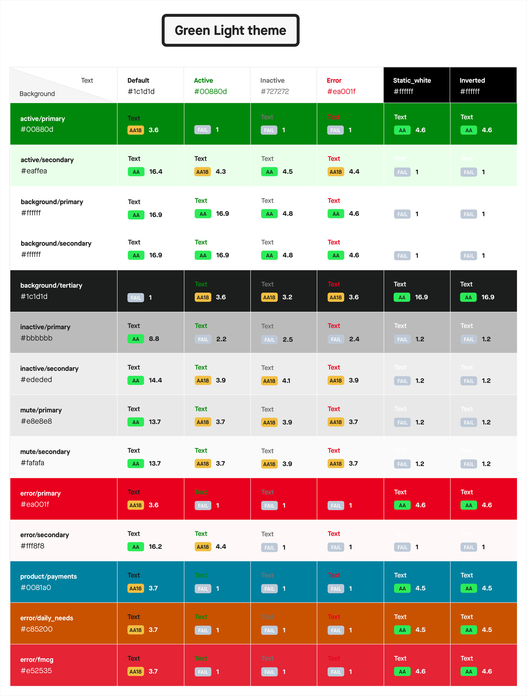

# Accessibility

Gojek gets more than a 100 million users per day. They vary in ages, tech knowledge, frequency of usage etc. In Indonesia alone, 8,56% of citizens have some form of disability. That’s 21,8 million people, and almost half of those have double disabilities (SUPAS 2015). Till now we’ve not designed for disabilities, either temporary or permanent. This leaves a major part of the users struggling to use our app.

We’d like to think that Gojek isn’t just for those with perfect eyesight, hearing or tactile ability. If anything, Gojek should make life easier for users, regardless of disabilities. Having a disability, chronic illness or another special need shouldn’t limit your ability to participate fully in activities other people may take for granted.

Be an a11y
a11y is a numeronym for Accessibility where the number 11 refers to the number of letters omitted. 

## What are our a11y principles
Designing with accessibility in mind means we are following our a11y principles:

### Clear
Help users navigate by designing clear and easy layouts with distinct calls to action. Enabling familiar, consistent interactions that make complex tasks simple and straightforward to perform. 

### Operable
Supporting assistive technologies and personalisation. Designing Gojek to adapt to environmental variations, such as device orientation, screen size, resolution, etc.

### Robust
Designing Gojek to accommodate a variety of users. We want people to enjoy Gojek in any context and on all supported devices. 

## How are we ensuring a11y compliance
We are taking various steps to ensure that Gojek as a product provides delightful experience to all our users. These are the steps -
### 1. Ensure 95~100% of our UI passes WCAG 2.0 Color contrast ratio value
We ensure that the colours used in our component and UI pass the WCAG guideline for AA standard.  It is not recommended that Level AAA conformance be required as a general policy for our entire UI because it is not possible to satisfy all Level AAA success criteria for some content. 

For the same purpose, we have modified the current colour palette coming from the branding guidelines to comply more wit colour contrast. We have a separate palette that we implement in our components, to be used in the UI. Although the palette is new, the base shades are still compliant with the ones coming from branding, since we want to ensure that the synergy between the branding, marketing and the actual app UI is maintained.

As mentioned before, we have created themes based on the overall product categories in Gojek; Consumer(Green), Merchants(Purple) and Third party apps(Pink). The following is the new palette, as suggested from the IxD end, which is 100% compliant with WCAG 2.0 ratios - 

### Consumer/Green Theme - 
Consumer/Green theme has the following colours, along with the compliance against the typography that we use in our app -

### Merchants/Purple Theme - 
Merchants/Purple theme has the following colours, along with the compliance against the typography that we use in our app -

### Third party/Pink Theme - 
Third party/Pink theme has the following colours, along with the compliance against the typography that we use in our app -

### 2. Improve our existing text style library to support better readability
Provide a new scale with bigger base size to address readability issues in driver/consumer app

### 3. Support theming in Aloha components
Create and maintain libraries for light and dark mode for aloha components. Provide a switch on the UI to toggle themes

### 4. Support screen reading and talk back
Ensure that our components support screen reading and talk back functionalities for blind/partially sighted people

### 5. Support haptic feedback
Use haptics consistently. For example, to notify people when a task has succeeded or failed or when an event is about to happen. 