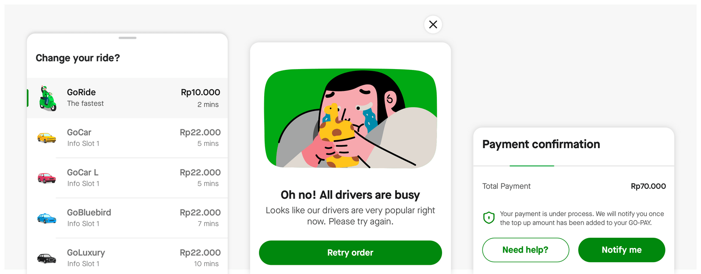
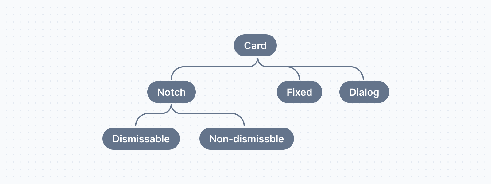
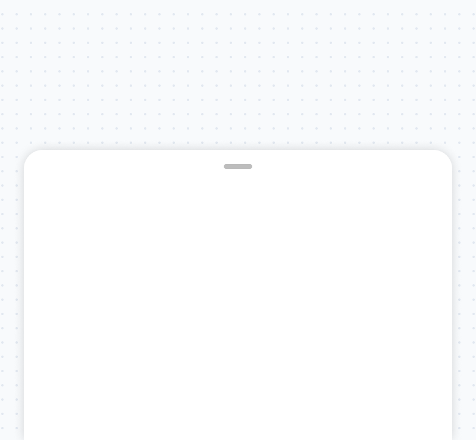
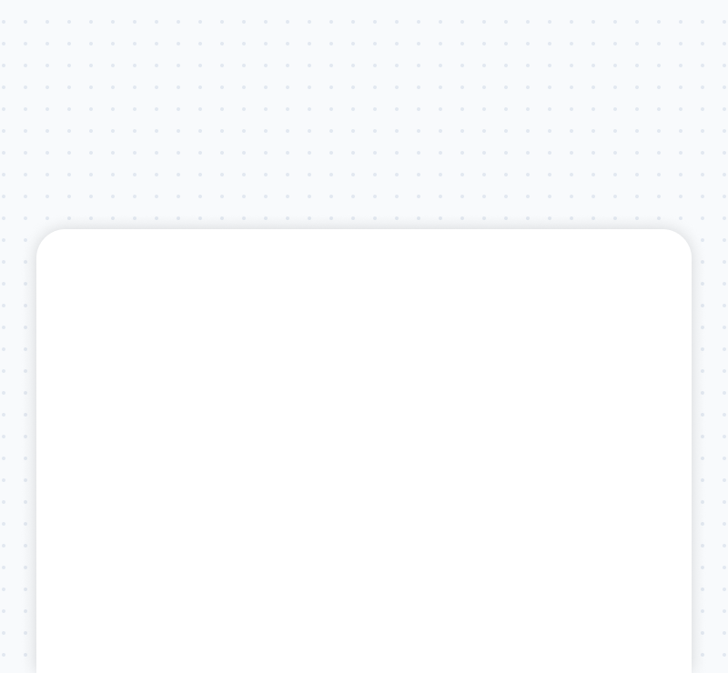
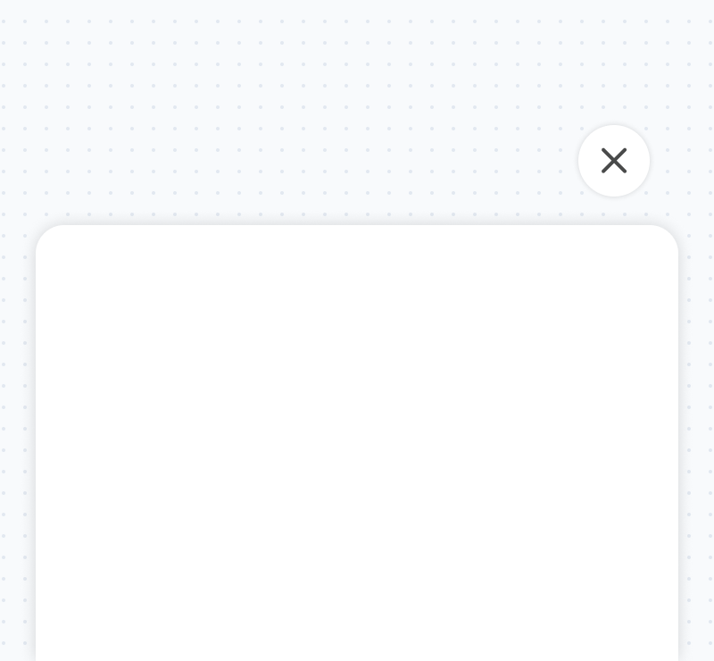

# Card

The card is a container to show content or actions relevant to the flow or a certain function. It always appears as the top layer in any layout and contains other components as a part of them, also has multiple behaviors depending on the way they are used in a flow.

## Availability

| Type | Status | URL |
| --- | --- | --- |
| Figma | Available |  |
| Motion Spec | Available | - |
| Accessibility | Available | - |
| Android | Available | |
| IOS | Available |  |
| Flutter | Available | https://source.golabs.io/asphalt/asphalt-aloha-android/-/blob/master/docs/asphalt-aloha/com.gojek.asphalt.aloha.inputfield/-aloha-input-field/index.md |

## Variant

The card component consisted of 3 variant which is notch, fixed, and card-dialog.

  

  
  

  <strong>Notch</strong>
    
used to show progress or information that needs to be inputted and is crucial for the user to complete the task.

  

  

  

  
  

  <strong>Fixed</strong>
    
used to show progress or information that needs to be inputted and is crucial for the user to complete the task.

  

  

  

  
  

  <strong>Dialog</strong>
    
used to show progress or information that needs to be inputted and is crucial for the user to complete the task.

  

  

  

## Usage

### Notch card Dismissable

- The dismissable notch card is used in multiple cases to show any information, choices, or summary. it can be dismissed completely by pulling it down and can not have any other cards on top of them.
- Use when less important information (that doesn't affect the task at hand) needs to fill on the same page.
- Use when a user needs to see less important/Hidden information (that is not highly dependent on the task at hand).

### Notch card non-dismissable

- The non-dismissable notch card will open in a partial view concerning the screen depending upon the screen resolution. it can be used to show any information, choices, or summary. It appears at the bottom of the screen, and able to pull it up to see more information inside the card or to interact with the card fully. This card can not be dismissed completely by pulling down but they will snap to their original size from previously.

### Fixed card
- The fixed card is used to show the progress or any information that needs to be inputted by the user and is crucial for the user to complete the task. This card does not dismiss and can only be transformed into the previous or next screen.
- Use between a flow that needs to show important information in the background of the card which is also related to the content inside the card and information is easy to fit inside the screen

### Dialog card
- The dialog card is used used to show alerts, choices, or text entries. This card is always the top layer on any screen or top of a notch or fixed card and is always dismissible using the cross icon button outside the card.
- Use for the error state case
- Use when the card contains information that can be easily fit on a screen and needs user action to proceed forward.

## Modifiable

| Variant | Show error state | Important information | Less information | Scrollable | Fit on screen |
| --- | --- | --- | --- | --- | --- |
| Dismissable notch card| 🚫 | 🚫 | ✅  | 🚫 | ✅ |
| Non-dismissable notch card | 🚫 | 🚫 | 🚫 | ✅ | 🚫 |
| Fixed card | 🚫 | ✅ | 🚫 | 🚫 | 🚫 |
| Dialog card | ✅ | ✅ | 🚫 | ✅ | ✅ |

## Behavior

### Notch card Dismissable
- Shows info to give affordance that the card can dismiss by swiping down.
- Have a task associated with it and will dismiss if that task is completed or chosen by the user. 
- Transit to non-dismissible function if more steps are involved in the user flow.
- The card will open from an action done by the user or a specific page.
- The card will never be used as the first card ever on the home screen. E.g. User taps on the change address icon on the home screen.
- If the card doesn't contain a lot of information that requires no scrolling inside the card. A single swipe anywhere on the card to dismiss it.
- If the card contains a lot of information that requires scrolling. In this case, the first card will attain its the full-screen position when swiped, and a 2nd swipe will dismiss the card.
- The card will have the option to add an overlay behind it.

### Notch card Non-dismissable
- Shows info to give affordance that the card is unable to dismiss by swiping down.
- Have a flow associated with it and will dismiss once a user completes that flow.
- The card will open to complete a flow. E.g. the user opens GoRide and sees the notch card non-dismissible to choose where they want to go.
- The card will open when the user navigates from The Notch card (Dismissible or Non-dismissible).
- The card will be dismissed when completes the task associated with it.
- The card can be morphed to the full screen whenever required. E.g. In GoRide, tap on the search component to transition to a full-screen card
- The card will have the option to add an overlay behind it.

### Fixed card
- Shows info to give affordance that the card is unable to dismiss by swiping down although the user can go back to the previous screen.
- Have a flow associated with it and will dismiss once a user completes that flow.
- The card will open to complete a flow. E.g. the user opens GoRide and sees the notch card non-dismissible to choose where they want to go.
- The card will open when the user navigates from the Notch card (Dismissible or Non-dismissible).
- The card will be dismissed when completes the task associated with it.
- The card can either be dismissed by going back or completing the task associated with it.

## Dialog card
- Contain an icon button on the right top side to give affordance the ability to dismiss it. 
- Have a flow associated with it and will dismiss once a user completes that flow.
- The card will open to complete a flow. E.g. select a payment method or Change in price due to a surge.
- It will be mandatory to an overlay behind.
- The card will be dismissed when a user completes the task associated with or presses the cross icon button or tap outside on the overlay.

## **Dos and Don’ts**

  

    
    
Use a dismissable notch card when less important information needs to fill on the same page

  

  

    
    
Don’t use a dismissable notch card to display user flow that is important to proceed in order to complete at hand. 

  

  

    
    
Use the non-dismissable notch card to display a flow that needs to show important information.

  

  

    
    
Don’t use a non-dismissable notch card to display screens that do not contribute to user flow e.g. error screen, confirmation screen, and low-priority information screen.

  

## Related component
Use the alert component to display important information related to the state of the flow, screen, app, or device and may or may not request an action.

## Changelog

| Date | Member Name | Change |
| --- | --- | --- |
| September, 1 2022 | Emje | Separated nude input field documentation |
| September, 1 2022 | Keith vaz, Emje | Update the status section |
| September, 1 2022 | Emje | Update structure documentation refer to new tempalte  and modifiable section Adding touch target section and  adding content guideline section |
| September, 1 2022 | Emje | Update the PIN Input field behavior |
