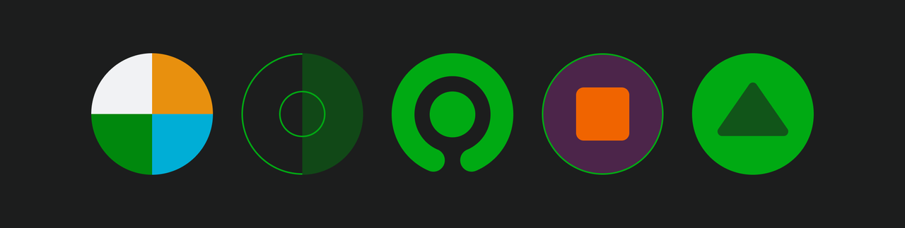
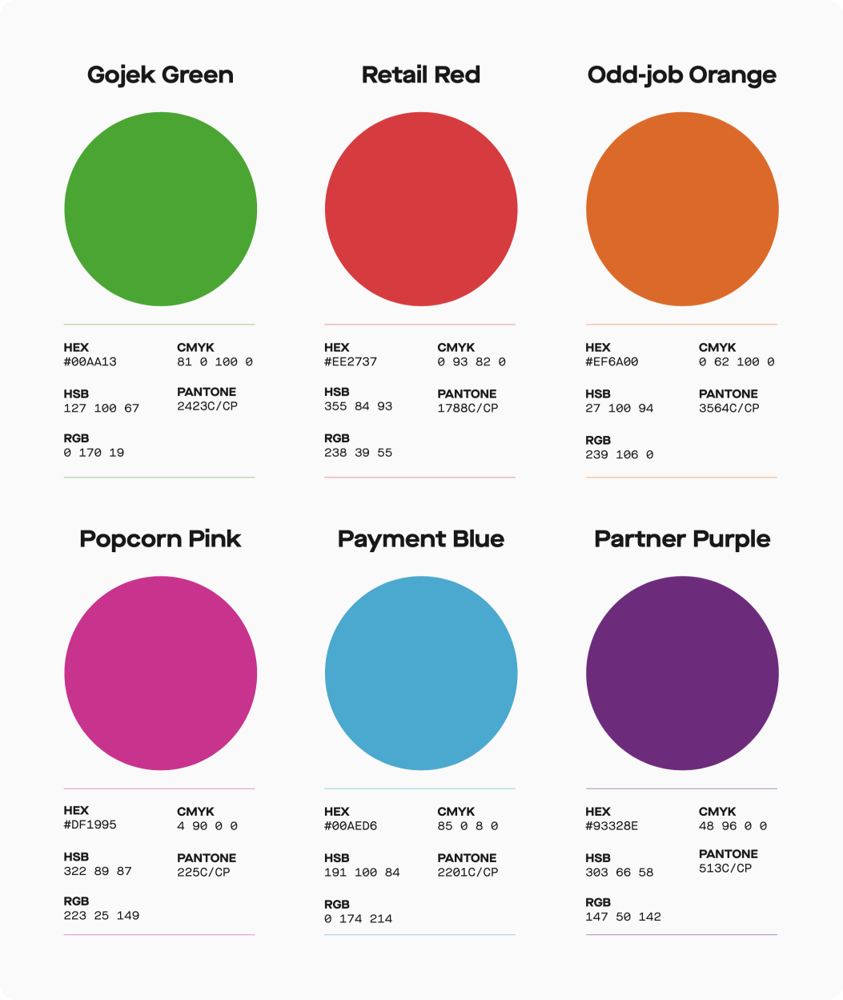
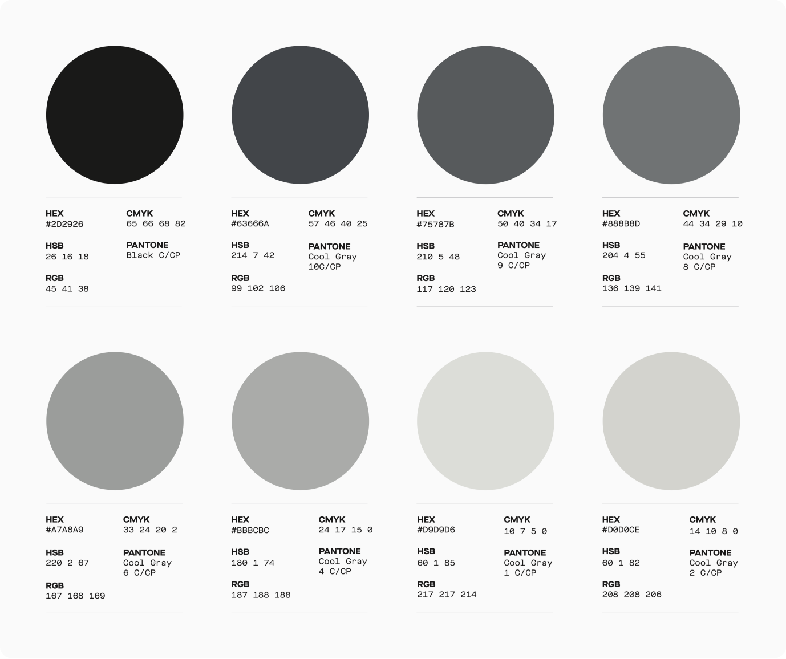
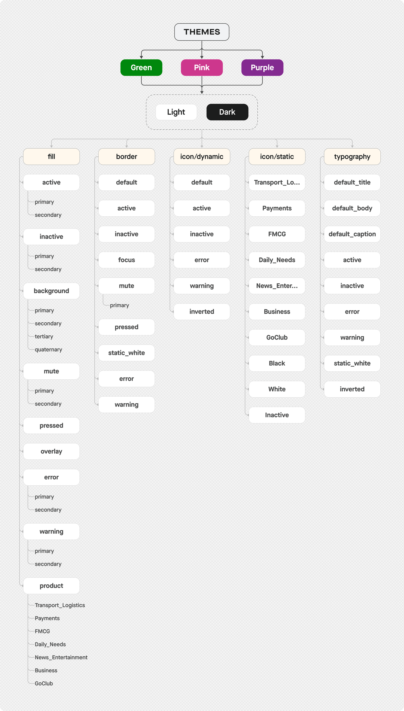
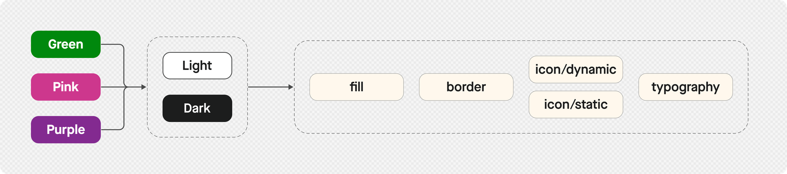

# Colours

Colours are one of the most visually recognisable elements of life that we see around us. Ever since the beginning, the human race has developed a keen sense of colours and have tried to associate them with certain traits. Colour guides us to predict, understand, and make decisions. You see something in red, you perceive it would mean danger (or more recently - food). See something in green, that could mean it's safe. Humans can't see the whole range of colours that exist in nature, but what we can see, we’ve learned to systemise. These systems can be dated back to centuries (as early as Aristotle, who, along with the members of his Peripatetic school, are credited with the first account of systemising colours), seen in various forms and have evolved into what we now use as digital models like RGB, RGBA, HSB, HSL, CMYK, PANTONE® etc.

## Need to systemise
Colour is a critical part of any system, but it can slip out of control easily. With a seemingly infinite number of hues, tints and shades, variability in different colour spaces, and various methods of picking and sampling colours, it’s easy to end up with dozens of colour values leading to inconsistent usage.

On the surface, it may appear simple, yet as it scales across products colours become unbelievably complex. Thousands of people building products all at once are all heavily reliant on colours and this puts a lot of pressure on the colour system to ensure all the products are consistent in appearance, although hard to implement in workflow.

By having a systemic approach to colours, we can ensure that we have a defined palette of consistent, accessible colours with the proper usage patterns. Using colours aligned with the brand helps build a connection between the brand and the products. 
Using accessibility compliant colours keeps your design accessible and inclusive. We have to ensure that the colours used in our product pass the AA or AAA contrast requirements set by WCAG.

Another important aspect of colours is to define roles. For instance, while showing a message to the user, certain colours help convey the content of the message - red for an error, blue for information, and green for a confirmation. By defining the meaning of certain colours, we can create a predictable pattern of how they are used in the product flows.

## Brand colours
Ever since Gojek’s inception, one colour has become the characteristic of the brand - Gojek green. We went through multiple iterations of this particular identifier, with the final colour value #00AA13.

As too many colours spoil the broth, we stick to six primary ones from our scheme.

Besides the primary brand colours and all the tints and shades of each, we also have a palette for the neutral colours.

## UI colours
Although we have an established brand colour palette, our system needs to answer questions about usage of colours in interface designs, its effectiveness and accessibility in various scenarios, adding and modifying colours. We have a slightly different approach to tackle these questions as compared to the brand colour system, as it needs to be in context of how colours are handled in the software and UI, rather than the brand and marketing aspect.

### A system based on themes
Asphalt colour token system aligns with Gojek’s rapidly growing scale of operations with new products with a simplified and more robust structure of the theme library. The structure is derived from the business goals and uses the overall product types/groups to define the colour themes -

Each of these themes are divided into children which have styles inherent to them. These children and the styles follow a common naming convention across all the themes, with a change in the value of the colour code. This helps in switching between them without making any changes to our system.

