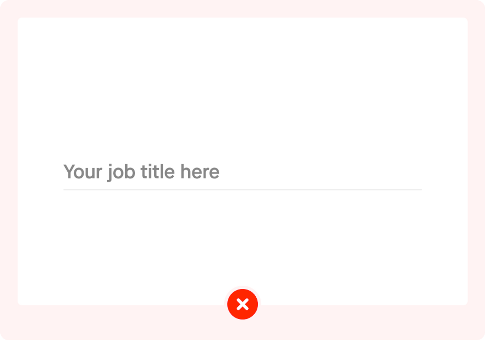

# Input field nude

The nude input field enables users to input and edit information in string format when necessary. It is commonly utilized in form elements such as registration forms, login forms, and more.

## Availability

| Type | Status | URL |
| --- | --- | --- |
| Figma | Available |  |
| Motion Spec | Available | - |
| Accessibility | Available | - |
| Android | Available | https://source.golabs.io/asphalt/asphalt-aloha-android/-/blob/master/docs/asphalt-aloha/com.gojek.asphalt.aloha.inputfield/-aloha-input-field/index.md |
| IOS | Available | https://source.golabs.io/asphalt/asphalt-aloha-android/-/blob/master/docs/asphalt-aloha/com.gojek.asphalt.aloha.inputfield/-aloha-input-field/index.md |
| Flutter | Available | https://source.golabs.io/asphalt/asphalt-aloha-android/-/blob/master/docs/asphalt-aloha/com.gojek.asphalt.aloha.inputfield/-aloha-input-field/index.md |

## Variant

The Nude input has two variant which is regular and large sizes.

## States

  

  
  

  

    <strong>Default state</strong>
    
This state includes a label, a text input field, and a clear button.

  

  

  
  

  

    <strong>Typing state</strong>
    
This state includes a label, a text input field, and a clear button.

  

  

   
  

  

     <strong>Typed state</strong>
    
In this state, the label and text input fields are filled.

  

  

   
  

  

     <strong>Error state</strong>
    
This state consists of a label, a text input field, and error messages.

  

  

   
  

  

     <strong>Inactive state</strong>
    
In this state, the label and text input fields do not have borders when disabled.

  

---

## Usage

- The regular nude input field uses when multiple input fields are required in a screen as a form element. They can be stacked together and made to be used in a crowded layout.
- The large nude input field uses for prominent input on the screen, like the amount inputs.

## Behavior

- Clicking/tapping the input field changes the default state to the typing state, accompanied by a caret and a 'clear text' icon on the right end. It changes to the typed state once the input is done.
- The clear button on the right only appears after the first character is typed by the user.

## Modifiable

| Variant | Clear button icon | Description |
| --- | --- | --- |
| Regular size | 🚫 | Keep the close clear button icon unchanged and position it in the default level of the typing state. |
| Large size | 🚫 | Keep the close clear button icon unchanged and position it in the default level of the typing state. |

## Content guidelines

- Label text should be short and succinct (a word or two), so that the users can quickly scan the form, and should be written in sentence case, for e.g., Enter the amount, Payment type, etc.
- Use short and meaningful placeholder

## **Dos and Don’ts**

  

    
    
The nude input field must have a label text.

  

  

    
    
Do not use a nude input field without a label.

  

  

    
    
Mark required/mandatory fields with a *.

  

  

    
    
Do not use too long label text.

  

---

## Accessibility

### Touch target

The input field on the typing state has a clear button function that contains the touch target - **48px width and height.**

---

## Changelog

| Date | Member Name | Change |
| --- | --- | --- |
| September, 1 2022 | Emje | Separated nude input field documentation |
| September, 1 2022 | Keith vaz, Emje | Update the status section |
| September, 1 2022 | Emje | Update structure documentation refer to new tempalte  and modifiable section Adding touch target section and  adding content guideline section |
| September, 1 2022 | Emje | Update the PIN Input field behavior |