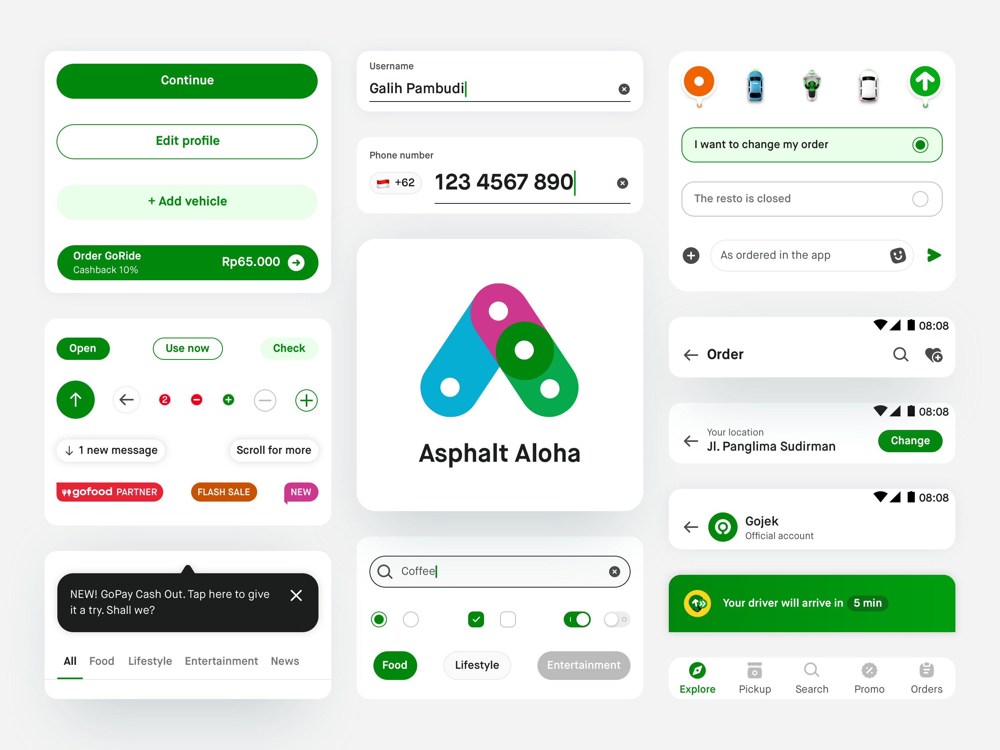

# Introductions 

## Welcoming Asphalt Aloha Design System

A lot has changed over the past year or so. We’ve got a new identity for Gojek(not GO-JEK anymore). In terms of our branding, there is a new colour palette, the typography has changed (RIP Neo-Sans-Medium), the visual style is bolder, and it’s time for the app to soak all of that in. For any great product to be successful for its users it needs to work well, should be easy to use and be MEMORABLE. We’ve had the good fortune of having a kickass branding team, that has helped us in solving the last part. It took almost 1 year to come up with the new branding guidelines and we can see the effort in the amazing new marketing campaigns, illustrations and the general creative aspect of Gojek. In addition to that, with these things being defined clearly, we’ve built new design tokens. These design tokens open the doors to being able to dive deeper into long term problems like building motion design into Asphalt or making Asphalt completely theme-able. 

All that is left now is for our users to see the same in our apps. And to kickstart all of this we require your superpowers . 

## What is Aloha?
Aloha is the next version for Gojek’s Design Language System - Asphalt. It is an upgrade to the original concept of our design system. The basic structure of the design system remains the same; a token library(atoms) which combines together to form a component(molecule), which are used to form the organism(screen/designs that we see). Even though the basics remain the same, there are various additions to Aloha, that can ensure that updating to it will mean an upgrade for our products.

## What is new in Aloha?
The following changes have been made to the new system -

### Same old efficiency and consistency, but now new
With Aloha, we are building on the same core principles of making our processes and designs as consistent and efficient as possible for all our users. With the introduction of Asphalt, we have already seen our apps being built to look great, work better and build faster. Now, Aloha is improving on all of these. We are also re-looking at our components and flows to ensure that they perform the best for our users in all use cases. 

### New token library
With Aloha, we have updated the current token library to reflect the branding aspects of Gojek. There are whole new Colour, Typography, Shadows and Spacing libraries in place, that the developers and designers can leverage, in order to make their products feel like a part of the new Gojek.

More on new token libraries

### Accessibility
Gojek gets more than a 100 million users per day. They vary in ages, tech knowledge, frequency of usage etc. In Indonesia alone, 8,56% of citizens have some form of disability. That’s 21,8 million people, and almost half of those have double disabilities (SUPAS 2015). Till now we’ve not designed for disabilities, either temporary or permanent. This leaves a major part of the users struggling to use our app.

We’d like to think that Gojek isn’t just for those with perfect eyesight, hearing or tactile ability. If anything, Gojek should make life easier for users, regardless of disabilities. Having a disability, chronic illness or another special need shouldn’t limit your ability to participate fully in activities other people may take for granted. More insight here.

With Aloha, we have ensured that the colours in our app pass the WCAG guideline for AA standard. This enables us to maintain colour contrast ratios for components used in our app. In the same interest, we have also increased the minimum font sizes from 10pt(Asphalt) to 12pt(Aloha), in order to ensure that legibility is maintained in all use cases. 

We are also working on some really interesting upcoming projects like Talk back, which can help our users to have an even more empowered experience, while using Gojek. More on that later!

With Aloha adoption, our products will automatically benefit from this and any new features that come in the future.

More on accessibility in Aloha

### Theming
With the introduction of new merchant apps as well as some third party apps like GoPlay, we have realised the need for the Gojek app to look and feel different and more customised to the respective users. This concept has been the driving force behind building theming into Aloha. The goal is to have a central set of components that can be used for all types of apps, but they can be themed to look and feel like the product they belong to. This saves a majority of time in solving similar problems in multiple products as well as building those solutions. An added bonus is switching to Dark mode :grinning: . Aloha components have the capability to switch between light and dark mode, based on the user’s preference. This will be a big help for our drivers.

### Motion as an inherent part
Static designs are boring. Over animated designs are difficult. It’s very hard to find the perfect balance between the two. With Aloha, we are ensuring that all our components and screens feel responsive and alive. After extensive research and experimentation, the motion design team has created interaction values for each component in our system, which can be used without any modification. Aloha components use these values and have them inbuilt whenever we are using them. This saves a lot of effort and time in building complicated animations for products and making sure that they are consistent across other products as well.

More on motion design in components

Check the demo app 

## Tools
The UXE team is working on new tools that developers and other stakeholders can leverage in order to make their workflow better.

### New creative assets
The rebrand has bought changes to the creative assets that represent our brand, its values and message. Using Aloha will help our products to embed new styles of illustrations, iconography as well as UX writing into our products.

In a not too distant future
### Haptic feedback
As part of the a11y(Accessibility) stream, we will be building haptic feedback into all Aloha components.

### Auditory feedback
This feature will be part of the a11y stream as well. Giving audio clues to users based on their actions helps visually impaired users to use app in a better manner. We will be building this functionality into our components

### Responsive components
With responsive Aloha components, our apps will be able to handle different orientations and device sizes, without the need to create new designs or writing new code.