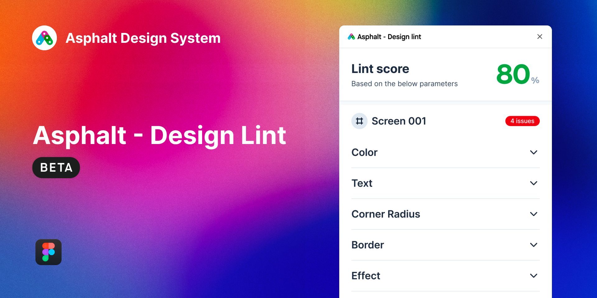
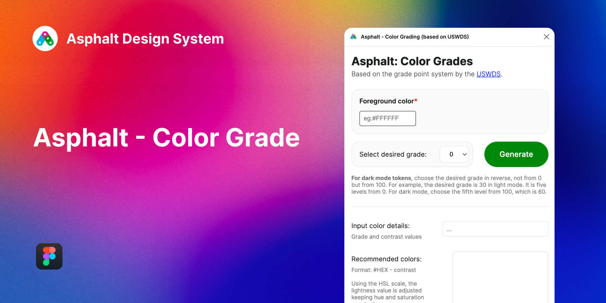
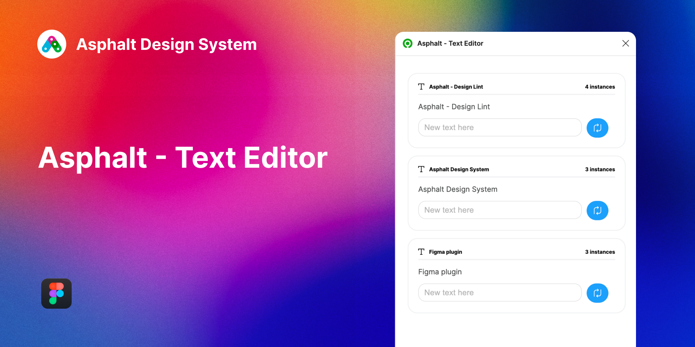
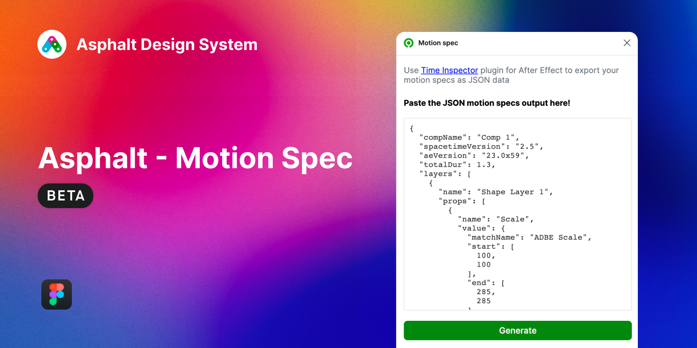

# Tools

Presenting our in-house plugin, skillfully developed by our talented internal team. This powerful tool is designed to seamlessly integrate into your workflow, allowing you to streamline your daily tasks and boost productivity.

  

  
  

  

    <strong>Asphalt - Design Lint</strong>
    
<a href="">download here</a>

  

  

  
  

  

    <strong>Asphalt - Color Grade</strong>
    
<a href="">download here</a>

  

  

   
  

  

     <strong>Asphalt - Text Editor</strong>
     
<a href="">download here</a>

  

  

   
  

  

     <strong>Asphalt - Motion spec</strong>
     
<a href="">download here</a>

  

