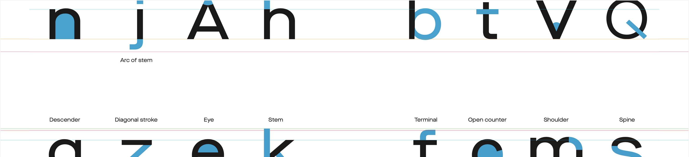
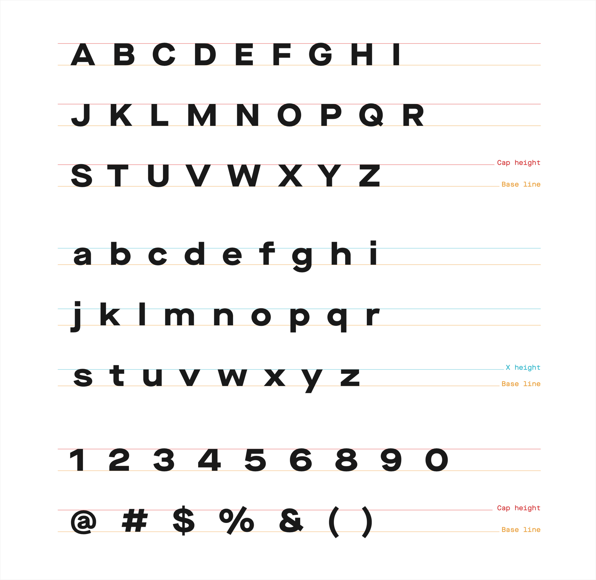
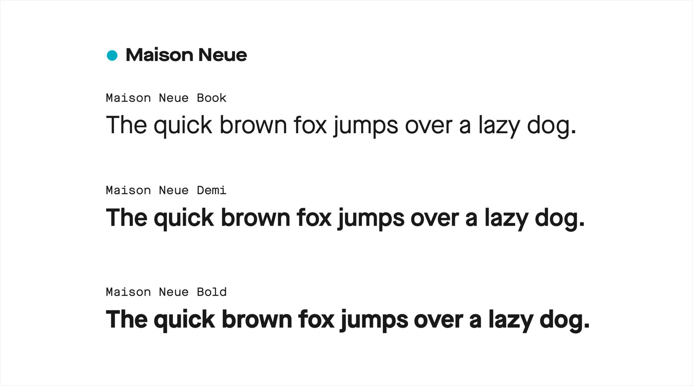

# Typography

The Asphalt design system uses Maison Neue as the primary brand typeface for its harmonic style and legibility. For core typography tokens, the Book, Demi, and Bold weights provide versatility across diverse UI use cases.

## Maison Neue
Choosing typefaces for digital requires cross-functional collaboration with brand and marketing to align with branding. The typeface conveys personality and tone.

For Gojek, Maison Neue was selected for its unique personality that strongly reinforces brand recognition. Its legible, contemporary character suits Gojek's friendly tone. Maison Neue offers versatility through 12 styles with extended Latin chars and OpenType features. The Extended and Mono versions provide creative typography flexibility while maintaining a consistent brand identity.

Overall, Maison Neue's diversity and brand alignment make it ideal for conveying Gojek's digital brand experience. Collaborative selection considered personality, legibility, flexibility, and consistency.

## Typography in Asphalt Aloha
### Typeface
Since Maison Neue was already decided from the branding guidelines, the next step for us was to select the type weights and styles.

### Typeweights
The Asphalt design system uses Maison Neue as the primary brand typeface for its harmonic style and legibility. For core typography tokens, the Book, Demi, and Bold weights provide versatility across diverse UI use cases. Italics were not used due to limited use cases that didn't warrant inclusion in the core typography system.

### Hierarchy, sizes, and line height
For type sizing, we opted for the Major Second scale, which uses a ratio of 1:1.125 between successive sizes. This creates a readable, harmonic progression.

The base size is 12px, increased from 9px for improved legibility of small text. Using the scale ratio, the sizes progress upwards from the base.

For line heights, we apply a factor of 1.3x (130%) to each type size and round to the nearest whole number. The slightly larger line height improves readability.

The naming hierarchy uses clear terminology aligned to both design and development:
Display: Very large sizes for high-impact text and numerals

Title: Hero to Tiny sizes for prominent text

Body: Moderate and Small sizes for paragraphs

Caption: Sparing use for sizes below Titles

This hierarchical naming ensures typography is efficiently communicated across designers and developers.